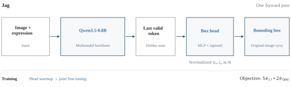
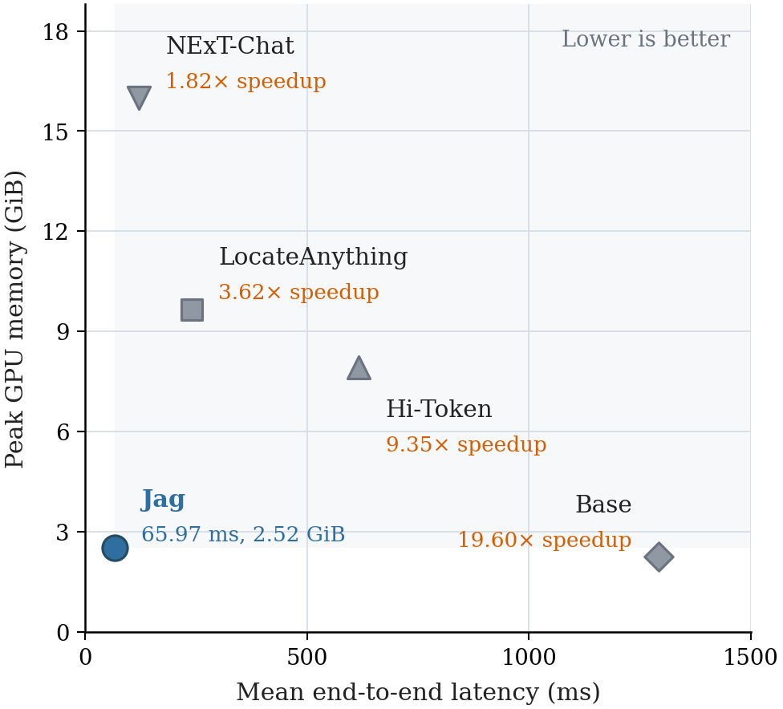

<div align="center">

# Jag

**Direct Box Prediction for Efficient Visual Grounding**

[Project page](https://xyzzzh.github.io/Jag/) · [Model](https://huggingface.co/xyzzzh/Jag) · [Demo](https://huggingface.co/spaces/xyzzzh/Jag)

[English](README.md) · [简体中文](README_zh.md)

</div>



## Introduction

Jag adapts a compact multimodal model for continuous bounding-box prediction. Inspired by [Jev](https://typesafe.ai/blog/introducing-system-one-models-and-jev), it returns the geometric answer directly, retaining the image–language processing of Qwen3.5-0.8B while removing autoregressive coordinate generation.

A lightweight MLP reads the last valid input-token representation and predicts normalized `cxcywh` coordinates in one forward pass. L1 and GIoU losses supervise head adaptation followed by joint training of the language backbone, visual merger, and regression head. The remaining vision encoder stays frozen.

Training uses **ModelScope ms-swift**, evaluation uses **EvalScope**, and **Docker** provides the environment. Optional **SwanLab** logging tracks training progress.

## Results

<!-- RESULTS:START -->
Accuracy at IoU ≥ 0.5 (%). RefCOCO and RefCOCO+ pool testA and testB by sample count; RefCOCOg uses test.

| Model | RefCOCO | RefCOCO+ | RefCOCOg |
| :--- | ---: | ---: | ---: |
| Base (Qwen3.5-0.8B) | 79.74 | 70.10 | 77.96 |
| NExT-Chat | 83.68 | 75.67 | 79.28 |
| LocateAnything | **91.35** | 84.12 | **88.54** |
| **Jag** | 91.28 | **85.80** | 87.72 |

Jag improves over Base across all five test splits and leads the compared models on three splits. See the [per-split results](evaluation/README.md).

Single-request end-to-end inference:

| Model | Latency ↓ (ms) | Throughput ↑ (samples/s) | GPU memory ↓ (GiB) |
| :--- | ---: | ---: | ---: |
| Base | 1293.01 | 0.77 | 2.25 |
| NExT-Chat | 120.01 | 8.33 | 15.99 |
| LocateAnything | 239.05 | 4.18 | 9.66 |
| Hi-Token | 616.90 | 1.62 | 7.91 |
| Jag | 65.97 | 15.16 | 2.52 |

Jag is **1.82× faster than NExT-Chat**, **3.62× faster than LocateAnything**, and **9.35× faster than Hi-Token** in the measured setting. Model loading and warmup are excluded. GPU memory is the sampled peak process memory.
<!-- RESULTS:END -->



See the [evaluation protocol](docs/evaluation.md) and [model card](MODEL_CARD.md).

## Quick start

Install Docker Compose and NVIDIA Container Toolkit, then clone the repository:

```bash
git clone https://github.com/xyzzzh/Jag.git
cd Jag
cp .env.example .env
```

### 1. Prepare data and the environment

Download and extract [train2014.zip](https://huggingface.co/datasets/omlab/VLM-R1/blob/main/train2014.zip). Set `REFCOCO_IMAGES_DIR` in `.env` to the extracted `train2014` folder, then prepare the RefCOCO annotation archive:

```bash
python3 scripts/prepare_data.py --archive /path/to/refcoco.zip --output data/refcoco
bash scripts/docker.sh build
bash scripts/docker.sh run --rm jag python scripts/download_model.py
```

The last command downloads the base model. Training uses `refcoco_train.jsonl`; evaluation uses the five test splits listed in the [data guide](docs/data.md).

### 2. Run the model

Download the published weights and predict a box:

```bash
bash scripts/docker.sh --eval run --rm jag \
  hf download xyzzzh/Jag --local-dir /models/Jag
bash scripts/infer.sh \
  --image /workspace/datasets/RefCOCO/train2014/your_image.jpg \
  --expression 'the person wearing a red shirt' --weight-dtype bf16
```

The result contains the bounding box in original-image pixels. You can also try the [online demo](https://huggingface.co/spaces/xyzzzh/Jag).

### 3. Train

```bash
bash scripts/train.sh
```

If `models/Jag` already exists, choose another export directory with `--export-output /models/Jag-trained`.

The [training recipe](configs/train/jag.json) trains on the combined RefCOCO-family training data and exports the completed model to `models/Jag`. For SwanLab, set `SWANLAB_API_KEY` and add `--swanlab`. See [training](docs/training.md).

### 4. Evaluate

```bash
bash scripts/evaluate.sh jag
bash scripts/evaluate.sh base
bash scripts/benchmark.sh
```

See [evaluation](docs/evaluation.md) for quality and inference measurements.

## Contributions

Contributions are welcome. See [CONTRIBUTING.md](CONTRIBUTING.md).

## Citation

```bibtex
@misc{zhu2026jag,
  title = {Jag: Direct Box Prediction for Efficient Visual Grounding},
  author = {Zhu, Xiuyuan and Lu, Ke and Wu, Hao and Du, Zijin and Zhang, Dongming and Xue, Jian},
  year = {2026},
  url = {https://xyzzzh.github.io/Jag/}
}
```

## License and acknowledgments

Code uses [Apache 2.0](LICENSE). Model weights and datasets retain their respective licenses. We thank [Jev](https://typesafe.ai/blog/introducing-system-one-models-and-jev), [Qwen](https://huggingface.co/Qwen/Qwen3.5-0.8B), [ms-swift](https://github.com/modelscope/ms-swift), [EvalScope](https://github.com/modelscope/evalscope), [SwanLab](https://github.com/SwanHubX/SwanLab), and the [COCO](https://cocodataset.org/)/[RefCOCO](https://github.com/lichengunc/refer) authors.
